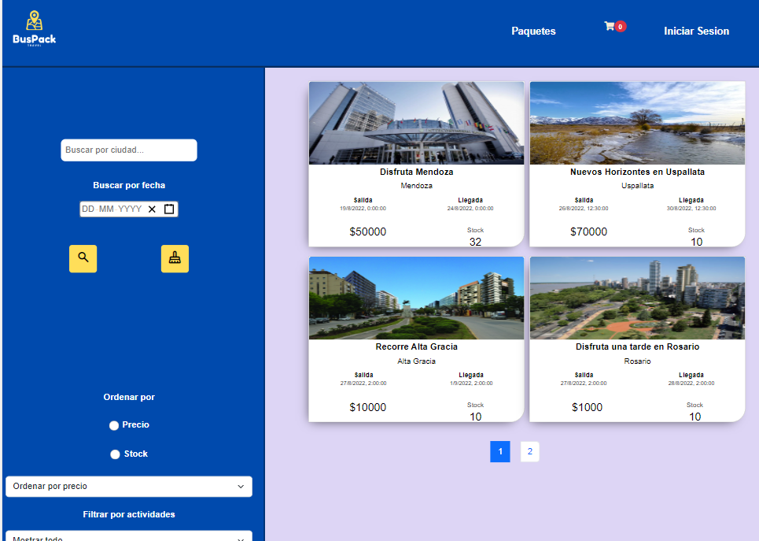
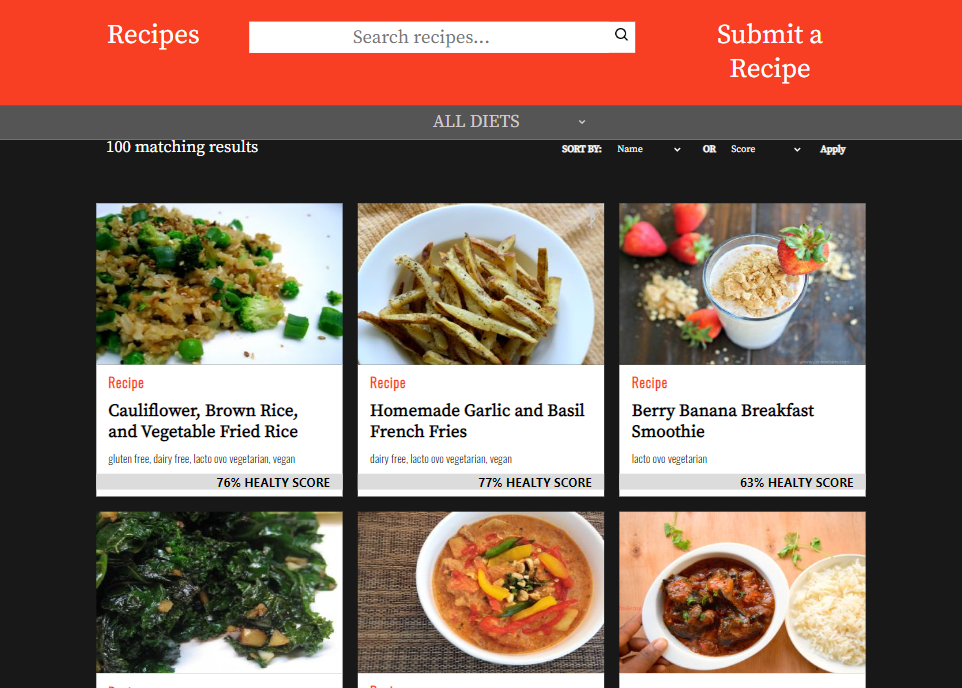
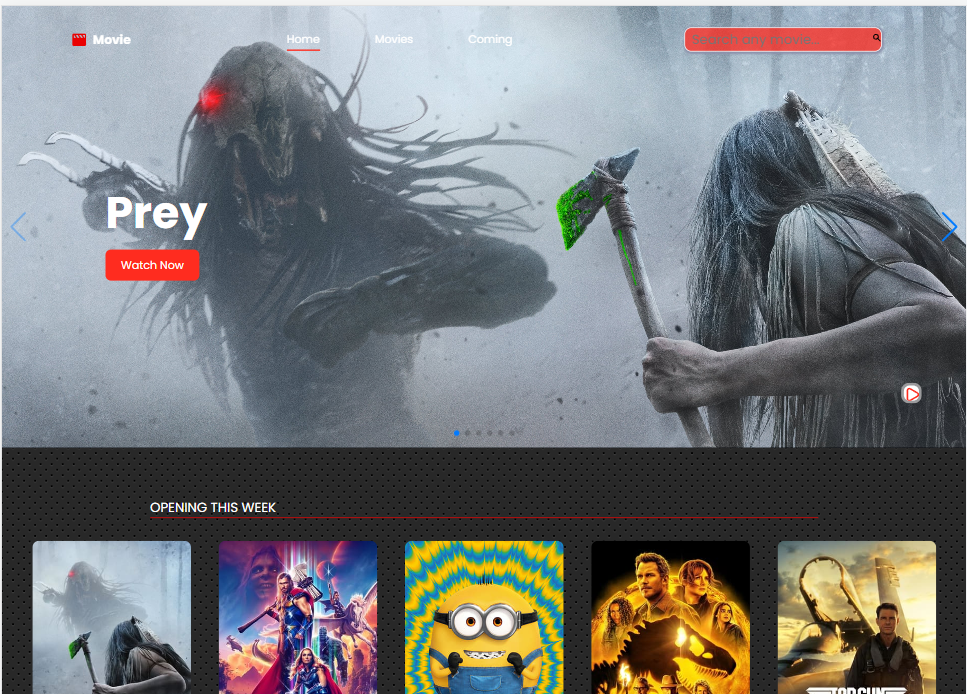
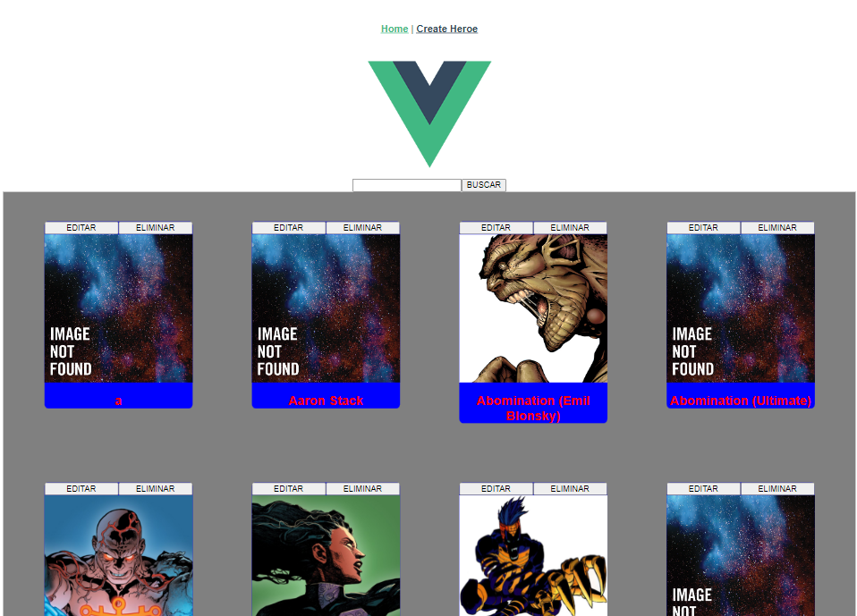
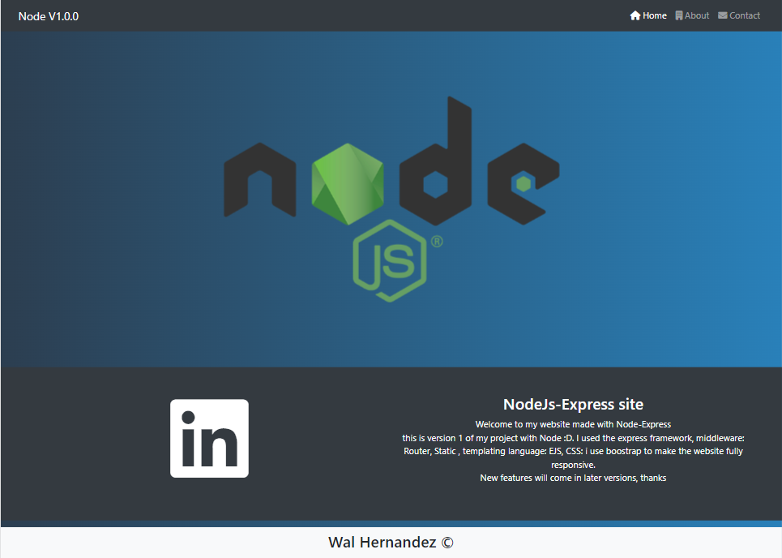

<h1 align="center">Hi 👋, I'm Walter Hernandez</h1>
<h3 align="center">A passionate FullStack developer from Argentina</h3>

  

  

- 🔭 I’m currently working on **EPPICAL**

- 🌱 I’m currently learning **Backend**

- 👨‍💻 All of my projects are available at [https://portfolio-wal-h.vercel.app/](https://portfolio-wal-h.vercel.app/) (In progress...)

- 💬 Ask me about **C#, .NET, SQL Server, Javascript...**

- 📫 How to reach me **walskp@gmail.com**

<h3 align="left">Connect with me:</h3>

<h3 align="left">Languages and Tools:</h3>

  <!-- C# -->
  
  <!-- Angular -->
   
  <!-- SQL Server -->
  
  <!-- CSS3 -->
    
  <!-- Git -->
   
  <!-- HTML5 -->
   
  <!-- JavaScript -->
   
  <!-- Node.js -->
   
  <!-- Postman -->
   
  <!-- React -->
   
  <!-- Redux -->
   
  <!-- TypeScript -->
   
  <!-- Vue.js -->
   

&nbsp;

## My Projects

**Travel App**

**Food recipes App**

**Movies App**

**Marvel App - VueJS**

**NodeJS App**

